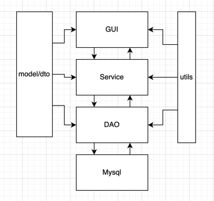

# zhku-computer-science面向对象与数据库综合应用课程设计

## 技术栈与要求
使用Java语言，jdbc进行数据库相关操作，数据库要求mysql，使用gui编写桌面客户端，实现完整的系统。

## 项目开发流程
一个完整的项目开发流程，需要包括需求分析、概要设计、详细设计、系统实现与测试、部署运行等流程。

需求分析包括系统性需求分析、非系统性需求分析、系统软硬件需求分析、可行性分析等。

本仓库主要涉及的是系统实现与测试、部署运行阶段的相关工作。

## 项目简介
项目目录结构如下：
```
~/workspace/javaspace/easy-zhku-mysql » tree                                                               urmsone@urmsonedeMacBook-Pro
.
├── README.md
├── deploy
│   └── user.sql
├── learner
│   └── src
│       └── cn
│           └── zhku
│               └── easy
│                   ├── Main.java
│                   ├── dao
│                   │   └── user
│                   │       ├── UserDao.java
│                   │       └── impl
│                   │           └── UserDaoImpl.java
│                   ├── dto
│                   │   ├── PageParam.java
│                   │   ├── UserQueryParam.java
│                   │   └── UserUpdateParam.java
│                   ├── gui
│                   ├── model
│                   │   └── User.java
│                   ├── service
│                   │   ├── UserService.java
│                   │   └── impl
│                   │       └── UserServiceImpl.java
│                   └── utils
│                       └── DBUtils.java
└── pom.xml
```

项目使用简单的三层结构，主要包括以下模块：
1. gui: 包含GUI界面
2. dao：包含数据访问对象 (DAO) 的代码，负责与数据库交互
3. dto：包含数据库操作相关参数的代码，表示操作数据库时相关参数的数据
4. model：包含数据模型类的代码，表示应用程序中的数据
5. service：包含业务逻辑的代码
6. utils：工具类，包括jdbc操作的封装，log日志类的封装等代码



## 项目TODO
1. gui功能界面的开发
2. 在utils中封装log工具类，工具类的实现是否适合使用单例模式？
3. model的getter和sette如何快速生成？使用idea的generate方式或者第三方封装好的库？  
4. 思考如何实现连接池
5. 思考如何将ResultSet的数据转成Java对象，如BeanUtil如何实现，需要用到反射和annotation么？
6. 数据库事务，如何实现？

## 项目管理与协同开发
